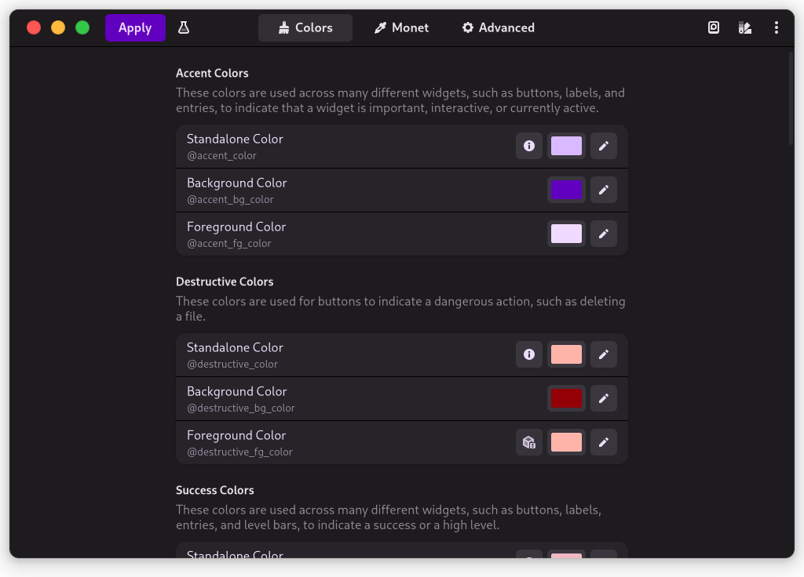
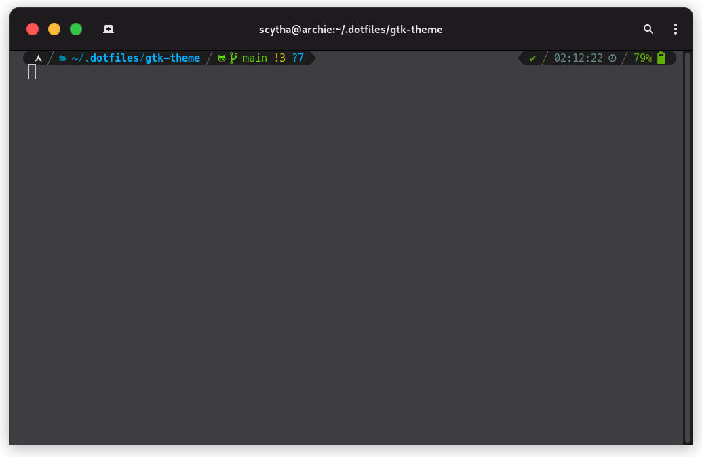
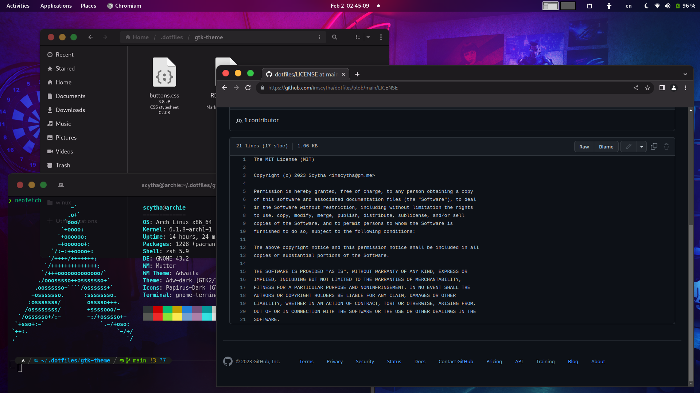

    
    <h1>GTK</h1>

> This is my custom GTK configuration for GNOME

### Requirements

To use this I installed [`adw-gtk3`](https://github.com/lassekongo83/adw-gtk3) which is an unofficial port of [_libadwaita_](https://gitlab.gnome.org/GNOME/libadwaita). It serves as a wrapper for unifying all GTK applications to a single theme (regardless the GTK version). This is particularly useful considering that the rise of GTK4 is still relatively new, and many applications lag behind in GTK3. For further information I recommend checking the repo.

I also highly recommend using a tool like [`Gradience`](https://github.com/GradienceTeam/Gradience) for further customizing libadwaita applications and the adw-gtk3 theme.

> **Note**
> The attached CSS in this repo [`buttons.css`](./buttons.css) is only for the window buttons. Further customization in colors can be achieved as I mentioned earlier with _Gradience_

### Gallery

    <h4>Preview in Gradience:</h4>
    
    <h4>Terminal Preview:</h4>
    
    <h4>Overall Preview:</h4>
    

